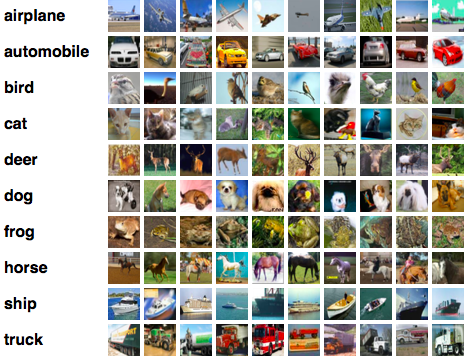

# Machine Learning Engineer Nanodegree
## Capstone Proposal
Rachit Kumar Agrawal
1st Sept 2017

## Proposal
_(approx. 2-3 pages)_

### Domain Background
_(approx. 1-2 paragraphs)_

I have picked up the domain of Computer Vision for my capstone project. In last decade, the amount of data has exploded exponentially. These data are in different forms - text, image and video. With each of these forms of data exploting it becomes extremely important to categorize them or classify them and classfication of these images is not humanly possible. So, it become important to let machine do it for us. I am personally motivated for this problem because, I feel this is first step to my ultimate goal to understand the Real Time Object Detection for Autonomous Driving.  

### Problem Statement
_(approx. 1 paragraph)_

The problem I am trying to solve is - "Object Recognition in Images". The goal is to recognize objects in the image and classify each of this image into 10 object classes. 

### Datasets and Inputs
_(approx. 2-3 paragraphs)_

For this problem, I am using CIFAR-10 image dataset. CIFAR-10 is an established computer-vision dataset used for object recognition. It is a subset of the 80 million tiny images dataset and consists of 60,000 32x32 color images containing one of 10 object classes, with 6000 images per class. It was collected by Alex Krizhevsky, Vinod Nair, and Geoffery Hinton. 

The dataset is divided into five training batches and one test bench, each with 10000 images. The test bench contains exactly 1000 randomly-selected images from each class. 

Here are the classes in the dataset, as well as 10 random images from each:

The classes are completely mutually exclusive. There is no overlap between automobiles and trucks. "Automobile" includes sedans, SUVs, things of that sort. "Truck" includes only big trucks. Neither includes pickup trucks. 

### Solution Statement
_(approx. 1 paragraph)_

I plan to use Convolution Neural Network (CNN) for this project because it's known to be best suited for any image dataset.

### Benchmark Model
_(approximately 1-2 paragraphs)_

### Evaluation Metrics
_(approx. 1-2 paragraphs)_

### Project Design
_(approx. 1 page)_

-----------

**Before submitting your proposal, ask yourself. . .**

- Does the proposal you have written follow a well-organized structure similar to that of the project template?
- Is each section (particularly **Solution Statement** and **Project Design**) written in a clear, concise and specific fashion? Are there any ambiguous terms or phrases that need clarification?
- Would the intended audience of your project be able to understand your proposal?
- Have you properly proofread your proposal to assure there are minimal grammatical and spelling mistakes?
- Are all the resources used for this project correctly cited and referenced?
